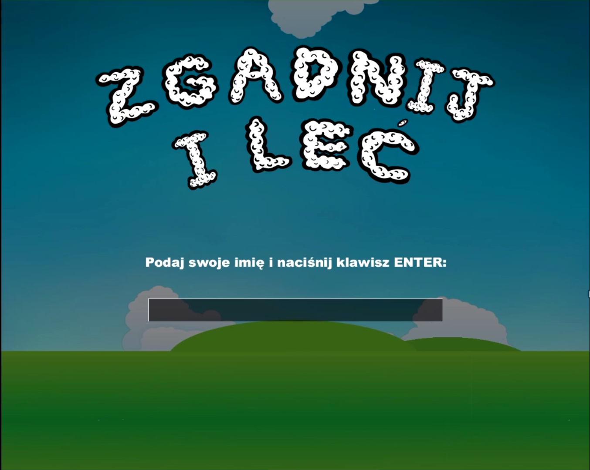
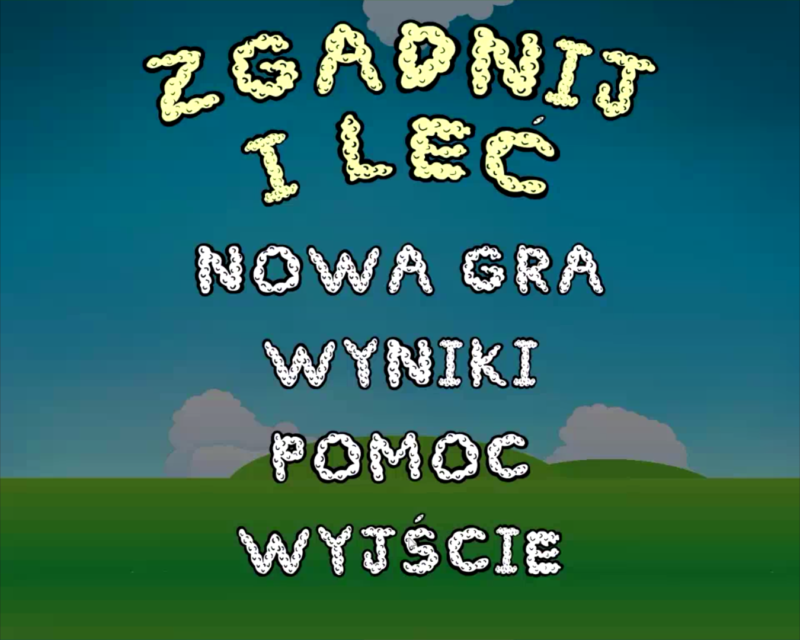
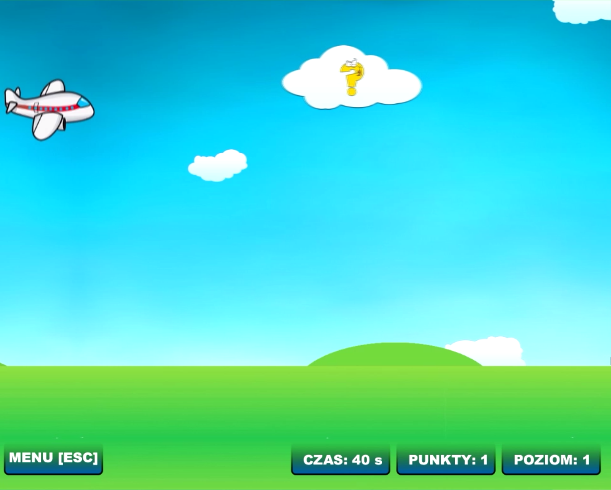
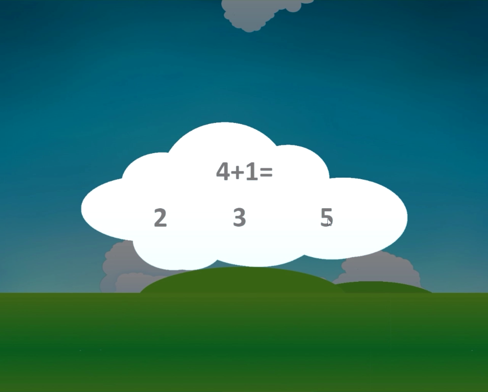
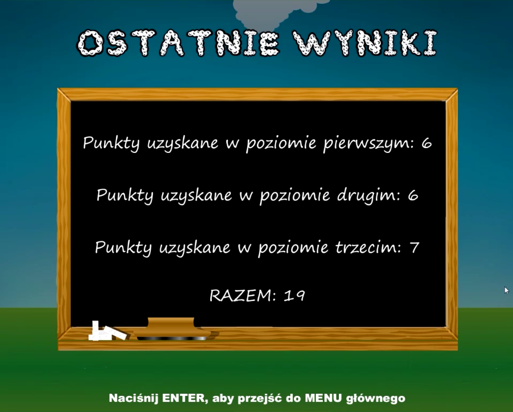
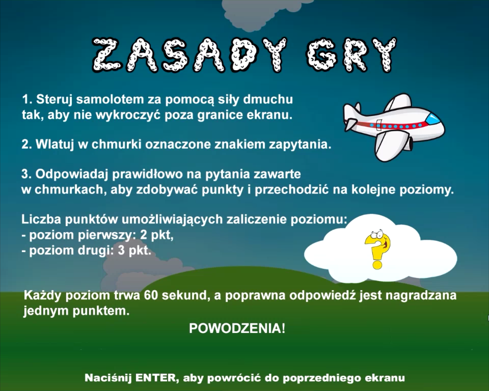

![Logo][logo-url]

# guess-and-fly-java

![Language][language-url] ![License][license-url] ![Version][version-url] ![Done][done-url] ![Maintenance][maintenance-url]

### 2D game for [eBlow](http://www.domestic.gda.pl/?p=136&lang=en) made with [Slick2D](http://slick.ninjacave.com/)

#### This game is intended to help people (mostly children) in speech therapy. The user's task is to control the airplane by air pressure and answer questions. The game consists of three levels.

## Screenshots
  
  

## Demo

[logo-url]: images/logocol.png "Logo"
[language-url]: https://img.shields.io/badge/language-Java-lightgrey.svg?style=flat "Language"
[license-url]: https://img.shields.io/badge/license-Apache%202-blue.svg?style=flat "License"
[version-url]: https://img.shields.io/badge/version-1.0.0-brightgreen.svg?style=flat "Version"
[done-url]: https://img.shields.io/badge/done-12.2014-yellow.svg?style=flat "Done"
[maintenance-url]: https://img.shields.io/maintenance/no/2014.svg?style=flat "Maintenance"
